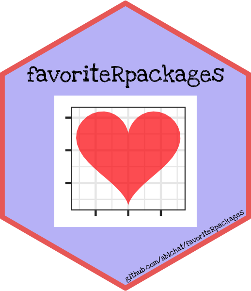

<!-- * **** - -->

# My favorite R packages 

## Tidyverse

  - **[dplyr](https://dplyr.tidyverse.org)** - A Grammar of Data
    Manipulation
  - **[forcats](https://forcats.tidyverse.org)** - Tools for Working
    with Categorical Variables (Factors)
  - **[ggplot2](https://ggplot2.tidyverse.org)** - Create Elegant Data
    Visualisations Using the Grammar of Graphics
  - **[glue](https://glue.tidyverse.org)** - Interpreted String Literals
  - **[lubridate](https://lubridate.tidyverse.org)** - Make Dealing with
    Dates a Little Easier
  - **[magrittr](https://magrittr.tidyverse.org)** - A Forward-Pipe
    Operator for R
  - **[purrr](https://purrr.tidyverse.org)** - Functional Programming
    Tools
  - **[readr](https://readr.tidyverse.org)** - Read Rectangular Text
    Data
  - **[readxl](https://readxl.tidyverse.org)** - Read Excel Files
  - **[rvest](https://rvest.tidyverse.org)** - Easily Harvest (Scrape)
    Web Pages
  - **[stringr](https://stringr.tidyverse.org)** - Simple, Consistent
    Wrappers for Common String Operations
  - **[tibble](https://tibble.tidyverse.org)** - Simple Data Frames
      - [Putting square pegs in round holes: Using list-cols in your
        dataframe](https://www.rstudio.com/resources/videos/using-list-cols-in-your-dataframe/)
  - **[tidyr](https://tidyr.tidyverse.org)** - Easily Tidy Data with
    ‘spread()’ and ‘gather()’ Functions

## Visualization

  - **[colorscale](https://github.com/dreamRs/colorscale)** - Create a
    Color Scale From a Single Color
  - **[cowplot](https://wilkelab.org/cowplot/)** - Streamlined Plot
    Theme and Plot Annotations for ‘ggplot2’
  - **[esquisse](https://dreamrs.github.io/esquisse/)** - Explore and
    Visualize Your Data Interactively
  - **[extrafont](https://github.com/wch/extrafont)** - Tools for Using
    Fonts
  - **[gganimate](https://gganimate.com)** - A Grammar of Animated
    Graphics
  - **[ggnewscale](https://eliocamp.github.io/ggnewscale/)** - Multiple
    Fill and Color Scales in ‘ggplot2’
  - **[ggrepel](https://github.com/slowkow/ggrepel)** - Automatically
    Position Non-Overlapping Text Labels with ‘ggplot2’
  - **[ggwrap](https://github.com/wilkox/ggwrap)** - Wrap A ‘ggplot2’
    Plot Over Multiple Rows
  - **[hexSticker](https://github.com/GuangchuangYu/hexSticker)** -
    Create Hexagon Sticker in R
  - **[patchwork](https://github.com/thomasp85/patchwork)** - The
    Composer of ggplots
  - **[scales](https://scales.r-lib.org)** - Scale Functions for
    Visualization
  - **[showtext](https://github.com/yixuan/showtext)** - Using Fonts
    More Easily in R Graphs
  - **[magick](https://docs.ropensci.org/magick/)** - Advanced Graphics
    and Image-Processing in R
  - **[rvg](https://github.com/davidgohel/rvg)** - R Graphics Devices
    for Vector Graphics Output

### News geoms

  - **[ggbeeswarm](https://github.com/eclarke/ggbeeswarm)** -
    Categorical Scatter (Violin Point) Plots
  - **[ggchicklet](https://cinc.rud.is/web/packages/ggchicklet/)** -
    Create ‘Chicklet’ (Rounded Segmented Column) Charts
  - **[ggecho](https://github.com/coolbutuseless/ggecho)** - GGplot Stat
    to Duplicate Elements
  - **[ggfittext](https://wilkox.org/ggfittext/)** - Fit Text Inside a
    Box in ‘ggplot2’
  - **[ggforce](https://ggforce.data-imaginist.com)** - Accelerating
    ‘ggplot2’
  - **[gghalves](https://github.com/erocoar/gghalves)** - Compose
    Half-Half Plots Using Your Favourite Geoms
  - **[ggimage](https://github.com/GuangchuangYu/ggimage)** - Use Image
    in ‘ggplot2’
  - **[ggpointdensity](https://github.com/LKremer/ggpointdensity)** - A
    Cross Between a 2D Density Plot and a Scatter Plot
  - **[ggpol](https://github.com/erocoar/ggpol)** - Visualizing Social
    Science Data with ‘ggplot2’
  - **[ggridges](https://github.com/clauswilke/ggridges)** - Ridgeline
    Plots in ‘ggplot2’
  - **[ggtext](https://github.com/clauswilke/ggtext)** - Improved text
    rendering support for ggplot2
  - **[ggtexture](https://github.com/clauswilke/ggtextures)** - Drawing
    Textured Rectangles and Bars with grid and ggplot2
  - **[ggwordcloud](https://lepennec.github.io/ggwordcloud/)** - A Word
    Cloud Geom for ‘ggplot2’
  - **[shadowtext](https://github.com/GuangchuangYu/shadowtext)** -
    Shadow Text Grob and Layer
  - **[treemapify](http://wilkox.org/treemapify/)** - Draw Treemaps in
    ‘ggplot2’
  - **[waffle](https://github.com/hrbrmstr/waffle)** - Create Waffle
    Chart Visualizations
      - [Building
        Pictograms](https://rud.is/rpubs/building-pictograms.html),
        [Building Waffle
        Charts](https://rud.is/rpubs/building-waffle-charts.html)
  - **[weather](https://github.com/dreamRs/weather)** - Weather Icons
  - **[ungeviz](https://wilkelab.org/ungeviz/)** - Tools for visualizing
    uncertainty with ggplot2
      - [Visualizing uncertainty with hypothetical outcomes
        plots](https://resources.rstudio.com/rstudio-conf-2019/visualizing-uncertainty-with-hypothetical-outcomes-plots)

### Themes

  - **[bbplot](https://bbc.github.io/rcookbook/)** - Making ggplot
    Graphics In BBC News Style
  - **[firatheme](https://github.com/vankesteren/firatheme)** - A
    ggplot2 theme using the Fira Sans font
  - **[fishualize](https://nschiett.github.io/fishualize)** - Color
    Palettes Based on Fish Species
  - **[gameofthrones](https://github.com/aljrico/gameofthrones)** -
    Palettes Inspired in the TV Show “Game of Thrones”
  - **[ggexpanse](https://github.com/hrbrmstr/ggexpanse)** - Theme
    Elements Based On ‘The Expanse’
  - **[ggpomological](https://github.com/gadenbuie/ggpomological)** -
    Pomological plot themes for ggplot2
  - **[ggpubr](https://rpkgs.datanovia.com/ggpubr/)** - ‘ggplot2’ Based
    Publication Ready Plots
  - **[ggsci](https://nanx.me/ggsci/)** - Scientific Journal and Sci-Fi
    Themed Color Palettes for ‘ggplot2’
  - **[ggtech](https://github.com/ricardo-bion/ggtech)** - ggplot2 tech
    themes and scales
  - **[ggthemes](https://jrnold.github.io/ggthemes/)** - Extra Themes,
    Scales and Geoms for ‘ggplot2’
  - **[ggthemr](https://github.com/cttobin/ggthemr)** - Themes for
    ggplot2
  - **[harrypotter](https://github.com/aljrico/harrypotter)** - Palettes
    Generated from All “Harry Potter” Movies
  - **[hrbrthemes](https://hrbrmstr.github.io/hrbrthemes/)** -
    Additional Themes, Theme Components and Utilities for ‘ggplot2’
  - **[LaCroixColoR](https://github.com/johannesbjork/LaCroixColoR)** -
    LaCroix Water Color
    Palettes
  - **[nationalparkcolors](https://github.com/katiejolly/nationalparkcolors)**
    - National Park Inspired Color Schemes
  - **[NineteenEightyR](https://github.com/m-clark/NineteenEightyR)** -
    198R
  - **[paletteer](https://emilhvitfeldt.github.io/paletteer/)** -
    Comprehensive Collection of Color Palettes
  - **[reasontheme](https://github.com/ReasonFoundation/reasontheme)** -
    A Reason Pension Integrity Project ggplot theme
  - **[Rokemon](https://github.com/schochastics/Rokemon)** - Pokemon
    Style Plotting And Data
  - **[see](https://easystats.github.io/see/)** - Visualisation Toolbox
    for ‘easystats’ and Extra Geoms, Themes and Color Palettes for
    ‘ggplot2’
  - **[tvthemes](https://ryo-n7.github.io/tvthemes/)** - TV Show Themes
    and Color Palettes for ‘ggplot2’ Graphics
  - **[urbnthemes](https://urbaninstitute.github.io/urbnthemes/)** -
    Additional theme and utilities for “ggplot2” in the Urban Institute
    style
  - **[wesanderson](https://github.com/karthik/wesanderson)** - A Wes
    Anderson Palette Generator

### 3D

  - **[gg3D](https://github.com/AckerDWM/gg3D)** - 3D perspective plots
    for ggplot2
  - **[rayrender](http://www.rayrender.net)** - Build and Raytrace 3D
    Scenes
  - **[rayshader](https://www.rayshader.com)** - Create and Visualize
    Hillshaded Maps from Elevation Matrices
  - **[rgl](https://cran.r-project.org/web/packages/rgl/)** - 3D
    Visualization Using OpenGL
  - **[mschart](https://ardata-fr.github.io/mschart/)** - Chart
    Generation for ‘Microsoft Word’ and ‘Microsoft PowerPoint’ Documents

## Spatial

  - **[cartography](https://riatelab.github.io/cartography/docs/)** -
    Thematic
    Cartography
  - **[countrycode](https://github.com/vincentarelbundock/countrycode/)**
    - Convert Country Names and Country Codes
  - **[leaflet](https://rstudio.github.io/leaflet/)** - Create
    Interactive Web Maps with the JavaScript ‘Leaflet’ Library
  - **[lwgeom](https://r-spatial.github.io/lwgeom/)** - Bindings to
    Selected ‘liblwgeom’ Functions for Simple Features
  - **[sf](https://r-spatial.github.io/sf/)** - Simple Features for R

## Reporting

  - **[cssgrid](https://cssgrid.atusy.net)** - Easy CSS Grid Layout For
    R Markdown And Shiny
  - **[icon](https://github.com/mitchelloharawild/icon)** - SVG icons
    for R documents
  - **[rmarkdown](https://rmarkdown.rstudio.com)** - Dynamic Documents
    for R
      - [R Markdown: The Definitive
        Guide](https://bookdown.org/yihui/rmarkdown/)

### Templates

  - **[blogdown](https://bookdown.org/yihui/blogdown)** - Create Blogs
    and Websites with R Markdown
  - **[bookdown](https://bookdown.org)** - Authoring Books and Technical
    Documents with R Markdown
  - **[distill](https://rstudio.github.io/distill/)** - ‘R Markdown’
    Format for Scientific and Technical Writing
  - **[officer](https://davidgohel.github.io/officer/)** - Manipulation
    of Microsoft Word and PowerPoint Documents
  - **[rolldown](https://github.com/yihui/rolldown)** - R Markdown
    Output Formats for Storytelling
  - **[thesisdown](https://github.com/ismayc/thesisdown)** - An updated
    R Markdown thesis template using the bookdown package
  - **[tint](https://github.com/eddelbuettel/tint)** - ‘tint’ is not
    ‘Tufte’
  - **[tufte](https://rstudio.github.io/tufte/)** - Tufte’s Styles for R
    Markdown Documents
  - **[vitae](https://docs.ropensci.org/vitae/)** - Curriculum Vitae for
    R Markdown
  - **[xaringan](https://github.com/yihui/xaringan)** - Presentation
    Ninja
  - **[xaringanthemer](https://pkg.garrickadenbuie.com/xaringanthemer/)**
    - Xaringan CSS Theme Generator

### Tables

  - **[flextable](https://davidgohel.github.io/flextable/)** - Functions
    for Tabular Reporting
  - **[gt](https://gt.rstudio.com/)** - Easily Create Presentation-Ready
    Display Tables
  - **[kableExtra](http://haozhu233.github.io/kableExtra/)** - Construct
    Complex Table with ‘kable’ and Pipe Syntax
  - **[rhandsontable](http://jrowen.github.io/rhandsontable/)** -
    Interface to the ‘Handsontable.js’ Library

## Statistics

  - **[bigstatsr](https://privefl.github.io/bigstatsr/)** - Statistical
    Tools for Filebacked Big Matrices
  - **[caret](http://topepo.github.io/caret/)** - Classification and
    Regression Training
  - **[evabic](https://abichat.github.io/evabic/)** - Evaluation of
    Binary Classifiers
  - **[factominer](http://factominer.free.fr)** - Multivariate
    Exploratory Data Analysis and Data Mining
  - **[mclust](https://mclust-org.github.io/mclust/)** - Gaussian
    Mixture Modelling for Model-Based Clustering, Classification, and
    Density Estimation
  - **[pqdr](https://echasnovski.github.io/pdqr/)** - Work with Custom
    Distribution Functions
  - **[quantreg](https://CRAN.R-project.org/package=quantreg)** -
    Quantile Regression
  - **[ranger](https://github.com/imbs-hl/ranger)** - A Fast
    Implementation of Random Forests
  - **[PLNmodels](http://julien.cremeriefamily.info/PLNmodels/)** -
    Poisson Lognormal Models

### Exploratory data analysis

  - **[DataExplorer](https://boxuancui.github.io/DataExplorer/)** -
    Automate Data Exploration and Treatment
  - **[janitor](http://sfirke.github.io/janitor/)** - Simple Tools for
    Examining and Cleaning Dirty Data
  - **[naniar](http://naniar.njtierney.com)** - Data Structures,
    Summaries, and Visualisations for Missing Data
  - **[santoku](https://hughjonesd.github.io/santoku/)** - A Versatile
    Cutting Tool for R
  - **[summarytools](https://github.com/dcomtois/summarytools)** - Tools
    to Quickly and Neatly Summarize Data

### Tidymodel

  - **[broom](https://broom.tidyverse.org)** - Convert Statistical
    Analysis Objects into Tidy Tibbles
  - **[parsnip](https://tidymodels.github.io/parsnip/)** - A Common API
    to Modeling and Analysis Functions
  - **[recipes](https://tidymodels.github.io/recipes/)** - Preprocessing
    Tools to Create Design Matrices
  - **[rsamples](https://tidymodels.github.io/rsample/)** - General
    Resampling Infrastructure
  - **[yardstick](https://tidymodels.github.io/yardstick/)** - Tidy
    Characterizations of Model Performance

### Networks and trees

  - **[ggraph](https://github.com/thomasp85/ggraph)** - An
    Implementation of Grammar of Graphics for Graphs and Networks
  - **[tidygraph](https://github.com/thomasp85/tidygraph)** - A Tidy API
    for Graph Manipulation
  - [**tidytree**, **treeio** and
    **ggtree**](https://yulab-smu.github.io/treedata-book/) - Data
    Integration, Manipulation and Visualization of Phylogenetic Trees
      - [Annotate a phylogenetic tree with
        insets](https://guangchuangyu.github.io/software/ggtree/vignettes/ggtree-inset.html)

## Programming

  - **[attempt](https://github.com/ColinFay/attempt)** - Tools for
    Defensive Programming
  - **[casewhen](https://github.com/RLesur/casewhen)** - Create Reusable
    ‘dplyr’ ‘case\_when()’ Functions
  - **[crayon](https://github.com/r-lib/crayon)** - Colored Terminal
    Output
  - **[cyclocomp](https://github.com/MangoTheCat/cyclocomp)** -
    Cyclomatic Complexity of R Code
  - **[furrr](https://davisvaughan.github.io/furrr/)** - Apply Mapping
    Functions in Parallel using Futures
  - **[future](https://github.com/HenrikBengtsson/future)** - Unified
    Parallel and Distributed Processing in R for Everyone
  - **[microbenchmark](https://github.com/joshuaulrich/microbenchmark)**
    - Accurate Timing Functions
  - **[R6](https://r6.r-lib.org)** - Encapsulated Classes with Reference
    Semantics
  - **[Rcpp](https://cran.r-project.org/web/packages/Rcpp/)** - Seamless
    R and C++ Integration
      - [Rcpp for everyone](https://teuder.github.io/rcpp4everyone_en/)
  - **[renv](https://rstudio.github.io/renv/)** - Project Environments
    for R
  - **[rlang](https://rlang.r-lib.org)** - Functions for Base Types and
    Core R and ‘Tidyverse’ Features
  - **[strict](https://github.com/hadley/strict)** - Make R Just a
    Little Stricter

## Package developement

  - **[attachment](https://thinkr-open.github.io/attachment/)** - Deal
    with Dependencies
  - **[chameleon](https://thinkr-open.github.io/chameleon/)** - Build
    And Highlight Package Documentation With Customized Templates
  - **[covr](https://covr.r-lib.org)** - Test Coverage for Packages
  - **[devtools](https://devtools.r-lib.org)** - Tools to Make
    Developing R Packages Easier
  - **[goodpractice](http://mangothecat.github.io/goodpractice/)** -
    Advice on R Package Building
  - **[pkgdown](https://pkgdown.r-lib.org)** - Make Static HTML
    Documentation for a Package
  - **[spelling](https://docs.ropensci.org/spelling)** - Tools for Spell
    Checking in R
  - **[testthat](https://testthat.r-lib.org)** - Unit Testing for R
  - **[usethis](https://usethis.r-lib.org)** - Automate Package and
    Project Setup

## Interactivity

  - **[beepr](https://github.com/rasmusab/beepr)** - Easily Play
    Notification Sounds on any Platform
  - **[dadjoke](https://github.com/jhollist/dadjoke)** - Return a Random
    Dad Joke
  - **[DT](https://rstudio.github.io/DT/)** - A Wrapper of the
    JavaScript Library ‘DataTables’
  - **[notifier](https://github.com/gaborcsardi/notifier)** - Cross
    Platform Desktop
    Notifications
  - **[rAmCharts](http://datastorm-open.github.io/introduction_ramcharts/)**
    - JavaScript Charts Tool
  - **[reactable](https://glin.github.io/reactable/)** - Interactive
    Data Tables Based on ‘React
    Table’
  - **[supercaliheatmapwidget](https://github.com/hrbrmstr/supercaliheatmapwidget)**
    - Supercalifragilistic HTML Calendar Heatmaps
  - **[tictoc](http://collectivemedia.github.io/tictoc/)** - Functions
    for timing R scripts, as well as implementations of Stack and List
    structures
  - **[timelineschart](https://github.com/dreamRs/timelineschart)** -
    Timelines Chart Htmlwidget
  - **[telegram.bot](https://ebeneditos.github.io/telegram.bot/)** -
    Develop a ‘Telegram Bot’ with R

### Shiny

  - **[fresh](https://dreamrs.github.io/fresh/)** - Fresh ‘Shiny’ Themes
  - **[golem](https://thinkr-open.github.io/golem/)** - A Framework for
    Robust Shiny Applications
  - **[htmlwidgets](http://www.htmlwidgets.org)** - HTML Widgets for R
  - **[shinipsum](https://thinkr-open.github.io/shinipsum/)** -
    Lorem-Ipsum-like Helpers for fast Shiny Prototyping
  - **[shiny](https://shiny.rstudio.com)** - Web Application Framework
    for R
  - **[shinybusy](https://github.com/dreamRs/shinybusy)** - Busy
    Indicator for ‘Shiny’ Applications
  - **[shinydashboard](https://rstudio.github.io/shinydashboard/)** -
    Create Dashboards with ‘Shiny’
  - **[shinypop](https://github.com/dreamRs/shinypop)** - Collection of
    Notifications for ‘Shiny’ Applications
  - **[shinysnippets](https://github.com/ThinkR-open/shinysnippets)** -
    RStudio Snippets for Shiny devs
  - **[shinyWidgets](https://dreamrs.github.io/shinyWidgets/)** - Custom
    Inputs Widgets for Shiny

## Web

  - **[httr](https://httr.r-lib.org)** - Tools for Working with URLs and
    HTTP
  - **[qrencoder](https://github.com/hrbrmstr/qrencoder)** - Quick
    Response Code (QR Code) / Matrix Barcode Creator
  - **[rtweet](https://rtweet.info)** - Collecting Twitter Data
  - **[slackr](https://github.com/hrbrmstr/slackr)** - Send Messages,
    Images, R Objects and Files to ‘Slack’ Channels/Users

### Mails

  - **[emayili](https://datawookie.github.io/emayili/)** - Send email
    messages
  - **[ponyexpress](https://docs.ropensci.org/ponyexpress/)** - Automate
    sending email with ‘Gmail’

## For biology

  - **[bigsnpr](https://privefl.github.io/bigsnpr/)** - Analysis of
    Massive SNP Arrays
  - **[phyloseq](https://joey711.github.io/phyloseq/)** - Handling and
    analysis of high-throughput microbiome census data
  - **[yatah](https://abichat.github.io/yatah/)** - Yet Another TAxonomy
    Handler

## Datasets

  - **[airparis](https://ardata-fr.github.io/airparis/)** - Open Data
    for Air Quality in Ile-de-France
  - **[datasaurus](https://itsalocke.com/datasaurus/)** - Datasets from
    the Datasaurus Dozen
  - **[gapminder](https://github.com/jennybc/gapminder)** - Data from
    Gapminder
  - **[nycflights13](https://github.com/hadley/nycflights13)** - Flights
    that Departed NYC in 2013
  - **[prenoms](https://github.com/ThinkR-open/prenoms)** - French Baby
    Names 1900-2017
  - **[tidytuesdayR](https://thebioengineer.github.io/tidytuesdayR/)** -
    Access the Weekly TidyTuesday Project Dataset
